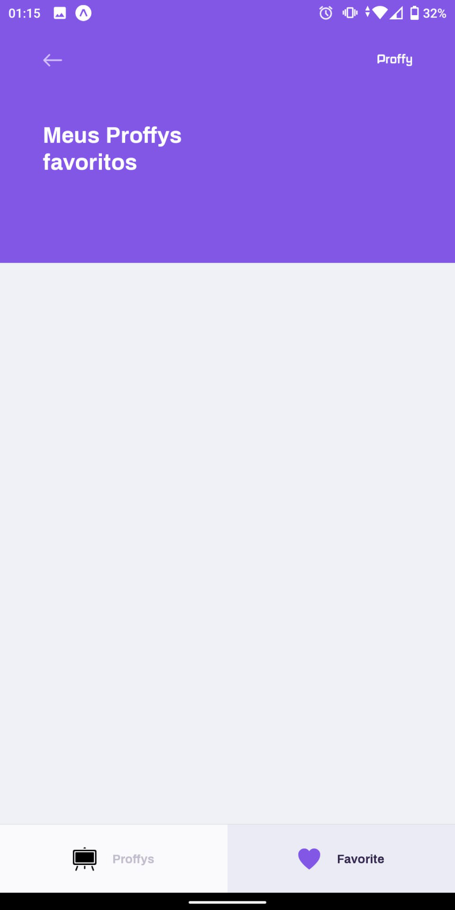

<p align="center">
   
</p>

<p align="center">	
   <a href="https://www.linkedin.com/in/romeuvicente/">
      
   </a>
  <a aria-label="Completed" href="https://nextlevelweek.com/episodios/omnistack/edicao/2">
    </img>
  </a>
  
</p>

> :rocket: Projeto elaborado para contato entre professores e estudantes, feito na Next Level Week #2 @Rocketseat

<p align="center">
    <a href="README.md">Inglês</a>
    ·
    <a href="README-pt.md">Português</a>
 </p>

<div align="center">
  <sub>The NLW #2 project. Built with ❤︎ by
    <a href="https://github.com/Romeuv">Romeu Vicente</a>
  </sub>
</div>

# :pushpin: Tabela de Conteúdo
* [Tecnologias](#computer-tecnologias)
* [Funcionalidades](#rocket-funcionalidades)
* [Como executar](#construction_worker-como-executar)
* [Encontrou um bug?](#bug-bug)
* [Licença](#closed_book-licença)

### Web Screenshot
<div style="display: flex; flex-direction: 'row'; align-items: 'center';">
   
   
</div>

### Mobile Screenshot
<div style="display: flex; flex-direction: 'row';">
   
   
   
   
</div>

# :computer: Tecnologias
Esse projeto foi desenvolvido utilizando as seguintes tecnologias:

* [Typescript](https://www.typescriptlang.org/)      
* [React](https://reactjs.org/)      
* [Expo](https://expo.io/)       
* [Express](https://expressjs.com/) 

# :rocket: Funcionalidades

* Site para registo de estudante e professores.
* App para conectar estudantes e professores.

# :construction_worker: Como Executar
```bash
# Clone o Repositório
$ git clone https://github.com/Romeuv/Proffy.git
```
### 📦 Executar a API

```bash
# Vá até a pasta do servidor
$ cd Proffy/server

# Instale as dependências
$ yarn install

# Execute a aplicação
$ yarn start
```
Acesse a API: http://localhost:3333/

### 💻 Executar o Project Web

```bash
# Vá até a pasta web
$ cd Proffy/web

# Instale as dependências
$ yarn install

# Execute a aplicação
$ yarn start
```
Acesse: http://localhost:3000/ para ver o resultado.

### 📱 Executar o Mobile Project
Para executar o projeto mobile é nessesário instar o [expo](https://play.google.com/store/apps/details?id=host.exp.exponent) no telefone, ou em um emulador **android/ios**.

```bash
# Vá até a pasta mobile
$ cd Proffy/mobile

# Instale as dependências
$ yarn install

# Execute a aplicação
$ yarn start
```
Then scan QRCode with the [expo] app (https://play.google.com/store/apps/details?id=host.exp.exponent) or run on an emulator.

# :bug: Bugs

Encontrou um bug? **Crie uma nova issue** com o respectivo titulo e descrição na página do bug do [Proffy](https://github.com/Romeuv/Proffy/issues) Repositorio. Se já encontrou uma solução para o bug, **de o seu pull request**.

# :closed_book: Licença

Lançado em 2020 :closed_book: Licença

Made by [Romeu Vicente](https://github.com/Romeuv) 🚀.
Esse projeto esta sobre [MIT license](./LICENSE).